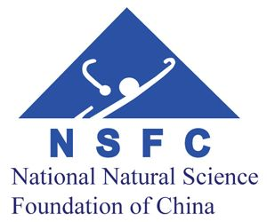
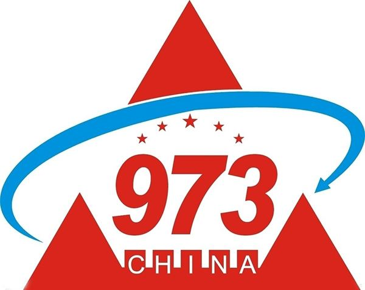

# Chenyu Yan

MS, Xi'an Jiaotong University, PRC

 <leo-chenyu.yan@stu.xjtu.edu.cn> 

## Education Background

I received BS degree with Electrical Engineering and Automation (GPA: 3.7, 10%) from [Northwestern Polytechnical University(NPU)](http://zdhxy.nwpu.edu.cn/English/English/Home.htm) in People Republic of China(PRC) in June 2016 and the topic of thesis is "Design of large scale Lithium-ion battery stack management system based on ARM". I received MS degree with Electrical Engineering (GPA: 3.7, 5%) from [Xi'an Jiaotong University(XJTU)](http://ee.xjtu.edu.cn/English_Version1/home.htm) in PRC in June 2019 and the topic of thesis is "Research on Electrical Breakdown Property of Polypropylene Nanocomposite Dielectric Modulated by Charge Transport and Molecular Displacement". 

During master's study,  I was in Prof. [Shengtao Li](http://gr.xjtu.edu.cn/web/sli/23;jsessionid=3EE36B730115F7EC2AB0CDF2C0723015)'s group and my  research focused on high voltage electric transmission, electrical property of nanocomposite  and charge transport modeling calculation. In the past 3 years, I have a relatively good understanding of high voltage transmission, electrical material (especially nano material and device) fabrication, characterization and testing, charge transport modeling and numerical calculation. Under my prof. [Daomin Min](http://gr.xjtu.edu.cn/web/sli/22)'s guidance, I gradually formulated ability to deal with academic research and got a deeper insight towards the electrical engineering. During this period, I was involved in 3 projects and had 15 papers published.

## Publications 

 [My Research Gate](https://www.researchgate.net/profile/Chenyu_Yan4) 

1. Min DM, <u>**Yan CY**</u>, Huang Y, et.al. Dielectric and carrier transport properties of silicone rubber degraded by gamma irradiation[J]. Polymers, 2016, 9(10): 1-15 (SCI: 000414913800071; EI: 20174304306504)
2. Min DM, <u>**Yan CY**</u>, Mi R, et.al. Carrier Transport and Molecular Displacement Modulated dc Electrical Breakdown of Polypropylene Nanocomposites[J]. Polymers, 2018, 10(11): 1-20 (SCI: 000454456800029; EI: 20184606058526) 
3. Min DM, Li YW, <u>**Yan CY**</u>, et.al. Thickness Dependent dc Electrical Breakdown of Polyimide Modulated by Charge Transport and Molecular Displacement[J], 2018, Polymers, 10(9): 1-18 (SCI: 000449988800081; EI: 20183805840118)
4. Min DM, <u>**Yan CY**</u>, Wang WW, et al. Electrical breakdown of polymer nanocomposites modulated by space charges[C]. IEEE 17th International Conference on Nanotechnology, 2017: 267-269 (EI: 20180604700270)
5. Xie DR, <u>**Yan CY**</u>, Huang Y, et al. Study on short-term dc breakdown and corona resistance mechanism of polyimide. Proceedings of 2017 International Symposium on Electrical Insulating Materials, 2017: 437-441 (EI: 20180704798615) 
6. Kang WB, **<u>Yan CY</u>**, Li ST, et al. Trap and carrier transport of pristine and aged silicone rubber by surface potential measurements[C]. Proceedings of 2017 International Symposium on Electrical Insulating Materials, 2017: 207-210 (EI: 20180704798674)
7. Li SJ, Yan W, <u>**Yan CY**</u>, et al. Surface trap and carrier transport of aged and pristine oil-paper under harmonic voltage by surface potential decay[C]. IEEE Conference on Electrical Insulation and Dielectric Phenomenon, 2017:94-97 (EI: 20181505007629) 
8. Cheng L, Chi XH, <u>**Yan CY**</u>, et al. Polypropylene nanocomposite for power equipment: a review[J]. IET Nanodielectrics, 2018, 1(2): 92-103 
9. Min DM, <u>**Yan CY**</u>, Huang Y, et.al. Influence of filler content on conductivity of epoxy resin nanocomposites[C]. The 20th International Symposium on High Voltage Engineering, 2017: 1-6
10. Min DM, <u>**Yan CY**</u>, Mi R, et al. Space-charge modulated electrical breakdown in polyethylene nanodielelctrics[J]. IEEE Nanotechnology Magazine, 12(2): 15-22.
11. Mi R, <u>**Yan CY**</u>, Wu QZ, Min DM, Li ST. Effect of deep traps and molecular motion on dc breakdown of polyethylene nanocomposites[C]. IEEE Conference on Electrical Insulation and Dielectric Phenomenon 2019 
12. Li YW, <u>**Yan CY**</u>, Min DM, Li ST. Numerical simulation on dc breakdown of polyimide based on charge transport and molecular chain displacement[C]. IEEE Conference on Electrical Insulation and Dielectric Phenomenon 2019
13. Kang WB, Meng SX, Cui HZ, Li YW, Mi R, <u>**Yan CY**</u>, Min DM, Li ST. Space charge accumulation in silicone rubber influenced by Poole-Frenkel effect[C]. International Conference on novel functional materials, 2018: 1-5 (EI: 20185306321507)
14. Cui HZ, Xing ZL, Wu QZ, <u>**Yan CY**</u>, Mi R, Min DM, and Li ST. Accumulation of space charges in epoxy resin nanodielectrics influenced by Poole-Frenkel effect, International Conference on novel functional materials 2019 
15. Kang WB, Meng SX, Cui HZ, <u>**Yan CY**</u>, Min DM, Li ST. Trap and dielectric property evolution of silicone rubber insulation under power frequency voltage superimposed harmonic [J]. High voltage (Chinese)    

## Scholarship and Awards 

### Scholarship ### 

1. National Scholarship	2018.11 & 2017.11
2. First class scholarship    2018.11 & 2017.11
3. Scholarship for excellent freshman    2016.09
4. Provincial special scholarship    2015.09
5. First class scholarship    2015.09 & 2014.09 & 2013.09
6. E+H special scholarship    2014.09

### Awards ###

1. Outstanding graduated student    2019.06
2. Merit master student award    2018.11 & 2017.11
3. National Mathematical Contest in Modeling for Graduated students, Honorable mention    2017.11
4. Outstanding graduated student    2016.06
5. The 5th session of MathorCup Mathematical Contest in Modeling, Outstanding award    2015.06
6. College Students' Innovative Entrepreneurial Training Plan Program, three projects in 2015 and 2014
7. International Mathematical Contest in Modeling (MCM), Honorable mention    2015.03
8. National Mathematical Contest in Modeling, Outstanding award    2014.11
9. Best debater in debate competition in China   2014.10
10. Excellent world teenager in Japan, Korea and China forum    2014.09
11. Merit student award    2015.11 & 2014.11 & 2013.11

##  Highlights of research

**Carrier Transport and Molecular Displacement Modulated (CTMD) model**

This model considers the charge injection, migration, trapping/detrapping and recombination dynamic process and depicts the continuous motion process of charges in the bulk of dielectrics.

 Fig. Scheme of CTMD model and molecular chain displacement model

Charges are continuously injected from electrodes to the bulk of samples and they may be captured by traps (both shallow traps and deep ones). When captured by deep traps, which means charges need to obtain higher energy to detrap, charge keep retention for a longer period. Also, during the migration from one electrode to another one, combination may occur when a positive charge encounters a negative one. Such a dynamic process includes entire charge motion process.  By setting boundaries of model and solving Poisson's equation, This model is used for calculating the charge transport property in the bulk of insulating material, including numerical calculation of space charge and electrical field distribution, energy gained by electrons as well as electrical strength. This model was once used for explaining the electrical breakdown behavior of polypropylene (PP, used for film of power capacitor) nanocomposite. By combining the experimental results and calculation of model, hidden electrical breakdown mechanism of PP nanocomposite was revealed. Details regarding the model can be seen in [Carrier Transport and Molecular Displacement Modulated dc Electrical Breakdown of Polypropylene Nanocomposites](#).

Based on this model, we investigate the electrical breakdown property of PI samples with various thicknesses. It is found that similar mechanism modulates the breakdown behavior of PI and simulations results are better fit than the space charge electrical breakdown (SCEB) model. Relating results and comparison can be found in [Thickness-Dependent DC Electrical Breakdown of Polyimide Modulated by Charge Transport and Molecular Displacement.](#)

**Dielectric property simulation of insulating material**

Method of modeling on dielectric property of aging Silicone Rubber is proposed. Specifically, by fitting the spectra to theoretical equations, we separated different polarization processes at various frequencies and calculated the values of corresponding parameters like thermal expansion coefficient, swelling ratio, etc.. By utilizing the correlations among various parameters, polarization property and specific process of SiR was delineated. Additionally, paper investigated the influence of degradation on the dielectric constant at high frequencies, ion concentration, conductivity and trap distribution, illustrating the charge transport property in the bulk of SiR and revealed the hidden cause for polarization. More information can be seen in [Dielectric and Carrier Transport Properties of Silicone Rubber Degraded by Gamma Irradiation](#)

For your information, more papers can be found in:

- [Electrical breakdown of polymer nanocomposites modulated by space charges](#)
- [Study on short-term dc breakdown and corona resistance mechanism of polyimide](#)
- [Trap and carrier transport of pristine and aged silicone rubber by surface potential measurements](#)
- [Surface trap and carrier transport of aged and pristine oil-paper under harmonic voltage by surface potential decay](#)
- [Polypropylene nanocomposite for power equipment: a review](#)
- [Space-charge modulated electrical breakdown in polyethylene nanodielelctrics](#)
- [Effect of deep traps and molecular motion on dc breakdown of polyethylene nanocomposites](#)
- [Numerical simulation on dc breakdown of polyimide based on charge transport and molecular chain displacement](#)
- [Space charge accumulation in silicone rubber influenced by Poole-Frenkel effect](#)
- [ Accumulation of space charges in epoxy resin nanodielectrics influenced by Poole-Frenkel effect](#)
- [Dielectric properties of aged and pristine oil-paper under harmonic voltage by frequency domain spectroscopy](#)

## Thesis paper

Title of my thesis paper is  "Research on Electrical Breakdown Property of Polypropylene Nanocomposite Dielectric Modulated by Charge Transport and Molecular Displacement". By combining the experimental results and modeling calculation results, the thesis proposes an explanation for demonstrating the mechanism of electrical breakdown property of PP/Al~2~O~3~ nanocomposite. 

### Overview on structure

Entire research of thesis includes sample fabrication, characterization and testing as well as modeling and analysis, shown as the graph below.

### Summary of results

It is worth mentioning that, based on the summary of current  synthetise method of nanocomposite, the thesis employed a new fabrication method to prepare samples, which turns out that fillers homogeneously  dispersed and both stability and dielectric property were enhanced compared with former results that employed original method.  

The thesis correlate the characterization and testing results, namely morphology, thermal, crystallization property and polarization, trap distribution, electrical strength, conductivity property. After analyzing the correlations among different property of samples, it was concluded that trap distribution has a main effect on electrical breakdown property of PP/Al~2~O~3~ nanocomposite. 

By comparing previous analysis and simulation results with the CTMD model, mechanism of PP/Al~2~O~3~ nanocomposite has been revealed. It turns that nanofiller introduced interfacial regions to the neat material. Therefore, trap distribution in the bulk of material is altered, leading to the changes in distribution of space charge and electrical field distribution. Also, due to the occupation effect of charges in the traps, molecular motion may be impeded , leading to an increase in energy gained by electrons and spur of local current. Such a coordination process results the electrical breakdown property of nanocomposites. Results of thesis well explained the reasons for electrical breakdown property enhancement, which is significant for further study on modulating electrical strength even other electrical properties of nanocomposites.

 Fig. Mechanism of electrical breakdown process of PP nanocomposite

## Project Experience ##

- **Influence of molecular chain motion property in interfacial regions on dc breakdown property of polyethylene nanocomposites (National Natural Science Foundation of China) ** 

This project was originated from the need for enhancing breakdown property of polyethylene to meet up with its demand for high voltage power transmission. Based on the motion property of molecular chains at the interfacial regions, this study investigated its impact on dc breakdown property of polyethylene nanocomposites and revealed the mechanism of nanocomposite breakdown. I'm responsible for experiments progress and paper writing (academic paper and project report).

- **Insulating property and its regularity of dielectrics in current transfer and energy dissipation (National Key Basic Research Program (973) sub-project)** 

    

This project investigated the coupling impact of space charge accumulation, transient arc micro particle bombardment, metal particle deposition on the falshover property of fractrue insulating system in the process of dc arc switching, and revealed its influence regularity and failure mechanism. Based on nanocomposition modification tech, study figured out the the methods to suppress the space charge accumulation and metal particle deposition in the fracture insulating system and proposed approaches to resist flashover damage and aging. This research provided the theoretical and technology support for enhancing the voltage, current as well as lifespan of circuit breaker. I was mainly involved in the modeling of energy accumulation and flashover process, and investigated the influence of charge transport parameters and temperature on flashover behavior.

- **Charge transport property in silicone rubber under harmonic aging (Project of China Electric Power Research Institute)** 

This project was originated from the need that power equipment like cable and bush are easier to be aged under the high-order harmonics, which hence deteriorated the performance of power system. The study, taking the silicon rubber from the outer coat of cable terminals and the insulating oil paper in the bush as the research objects, quantificationally manifested the aging status and summarized the insulating material deterioration regularity. In addition, aging model for cable and bush were proposed to predict their odd lifespans and the mechanism of aging have been demonstrated. I was responsible for experiment design, experiment accomplishment, modeling calculation and paper writing.

## Work Experience and Internship ## 

**State Grid Corporation of China   Department of Information and Internet	2019.09 - Now** 

I worked in State Grid Corporation of China (SGCC), known as the largest corporation in China, for half a year. In this period, I worked as a member in Department of Information and Internet, which focuses on data collection and processing to propose practical suggestions for the development of corporation. I have been involved in a project to predict short-term load of grid power, including day load forecast and workload forecast. This work aimed at suppressing illegal electric larceny especially in corporation with relatively higher demand for electric resources, so that the lost profits can be reclaimed and SGCC also has a greater power to better distribute the power transmission. In this project, I was responsible for forecast modeling and data processing, which provided the basis of prediction. Specifically, with the previous data of electric usage as the input, model was based on RNN and LSTM model to forecast the electric demand for following 7 days. By comparing with realistic values, it was proved that model had a relatively high precision and value of MAPE was around 2.4%.

**Asea Brown Boveri Ltd., China      Electrical Engineer Internship        2016.05-2016.09** 

I was a internship of technology department in ABB for four months. During this period, I have the initial understanding of industrialization of power system, especially the power capacitor. With an increase in familiarity with equipment, I have a more lucid concept for structure of power system and commercial market in this field. Plus, with the support of investigation in the equipment workshop, I learned the processing flow of capacitor, starting from the polypropylene film fabrication to the component assembly. In addition, I also got an opportunity to be engaged in the technical discussion with foreign experts, which largely bring inspiration to my further exploration on the research. Through intensive discussion, I found that increasing demand for high voltage transmission had been an urgent need for the grids in China, property of electric breakdown, however, was a key factor that determined the performance of power capacity. Therefore, when choosing the major field in my master phase, I forwardly approached to my professor and expressed my plan on the research of breakdown property of polypropylene. One more thing, it is worth being mentioned that I developed a program based on C++ during my internship to help collecting documents to meet the needs of engineers, which has been integrated to the system of ABB and used until now.

## Personal Statement ## 

In the study of past seven years, I keep conscientious on my study and got a relatively good grade, which guarantee my solid knowledge basis of Electrical Engineering. I have ever obtained national scholarship, first campus scholarship, special scholarship, freshman scholarship for over 10 times and were awarded as excellent student, excellent graduated student for 9 times. In addition to hectic study, I was also enthusiastically engaged in activities and competitions. I participated **Mathematical Contest in Modeling** and obtained international/national award for 7 times. I do enjoy MCM, since it can bring lots of uncertainty and I need to learn some new knowledge and skills in a short time, during which I need to cooperate with my teammates and summarize possible methods. After successive data collection, modeling and calculation, as well as numerical verification were conducted and this entire process is concluded in an essay to illustrate how to solve problems in a large scale. Experience of MCM helps to build a good mathematical thinking and a good ability to modeling calculation as well as paper writing. Moreover, I also have attended **Model United Nation Conference** for several times, which largely inspires me to know a bigger world, gender equality, international economy, racial discrimination and numerous topics effectively broaden my horizon and formulate my ability to research, negotiate, caucus and cooperate with other people. It needs to be mentioned that my spoken and written English was largely promoted after intensive training for conferences. Similar to MUN conference, **debate competitio**n (including Chinese competition and English competition) also helped to bring up ability of logical thinking and effective communication. Training of competition leads me to better interact with people and have a structural framework when analyzing problems. All these activities can foster my personal ability to some extent and finally revealed in my learning and research, I hence do have confidence on my learning ability and potential possibilities.

In addition to academic research and activity enrollment, I was also passionately involved in internship and practical work. I have intern/work experience in **ABB** and **STATE GRID Corporation of China**. After graduating from NPU, I chose to do intern work in ABB for 4 months. During this period, I have an initial understanding of industrialization of power system, especially the power capacitor. With an increase in familiarity with equipment, I have a more lucid concept for structure of power system and commercial market in this field. Plus, with the support of investigation in the equipment workshop, I learned the processing flow of capacitor, starting from the polypropylene film fabrication to the component assembly. In addition, I also got an opportunity to be engaged in the technical discussion with foreign experts, which largely bring inspiration to my further exploration in this field. Through intensive discussion, I found that increasing demand for high voltage transmission had been an urgent need for the grids in China, property of electric breakdown, however, was a key factor that determined the performance of power capacity. Therefore, when choosing the major field in my master phase, I forwardly approached to my professor and expressed my plan on the research of breakdown property of polypropylene. Different from most researches, I attached more emphasis on the simulation and modeling calculation, which can reveal the interior mechanism and bring more novel ideas to this field. One more thing, it is worth being mentioned that I **developed a program based on C++** during my internship to help collecting documents to meet the needs of engineers, which was applied to be integrated to power production management system and used until now. After graduating from XJTU, I worked in State Grid Corporation of China (SGCC), known as the largest power corporation in China, for half a year. In this period, I worked as a member in Department of Information and Internet, which focuses on data collection and processing to propose practical suggestions for the development of corporation. I have been involved in a project of predicting short-term load of grid power, including day load and workload forecast. This work aimed at suppressing illegal electric larceny especially in corporation with relatively higher demand for electric resources, so that the lost profits can be reclaimed and SGCC also has a greater power to better distribute the power transmission. In this project, I was responsible for forecast modeling and data processing, which provided the basis of prediction. Specifically, with previous data of electric usage as the input, model was based on RNN and LSTM model and parameters were determined by data training to forecast the electric demand for following 7 days. By comparing with realistic values, it was proved that model had a relatively high precision and value of MAPE was around 2.1%. This can be a relative basis for following study regarding the machine learning and artificial intelligence, which is promising to foster interdisciplinary research.

Project experience is very important for one’s combination of theoretical knowledge and practical skills. I have ever participated in three projects in BS phase, which were all originated from National innovation training program. Their research scale covers design of lithium battery system management system, design of signal transmission system with high performance, and campus faculty evaluation system development. These projects provided basic research experience to me. Specifically, it taught me have an initial concept of engineering practice and academic research. When it comes to MS phase, I have ever been involved in three projects. 

My previous academic and researches do pave the way my following study and I am confident in fulfilment of this program.

# Statement of Purpose

During the learning and research in past few years, I had a deeper insight into the academic research and the desire to explore the unknown. Decision of applying for OMSCS at Galtech has been carefully considered and I do make much preparation for this program. Here I will make a brief summary regarding why I want to take this program. 

The first time I heard about OMSCS program from my friend who was participating in it. Enlightened by his recommendation, I came to know more about this program. Initially, I thought online course may be not be tantamount to on campus courses, where there is a huge gap between them for many reasons like sparse interaction with professor and less decent class experience, however when coming to know more details like the course structure and class arrangement, I find it really perfectly matches my need. For one thing, I can largely extend my insight towards computer science to make preparation for following study and the teachers are really conscientious in teaching and interaction with students, for another thing, I have many options on course selection, like Computer Network, Database, Compiler, High Performance Computing Architecture, Operation System / Advanced OS, Algorithm, which are well consistent with my needs. I can find the most suitable courses for me and I can complete some significant work with classmates, which is really attractive. Then I decided to apply for program of 2020 Fall, however, plagued by COVID-19, I cannot take exams as planned but can only use the score taken before. I have to say that I do have capability to freely communicate with classmates and hardly have any barriers in comprehending online classes. If possible, I’m so willing to have an online interview for language qualification. 

### A Systematic Study of CS

In the first place, I want to have a systematic study of computer science rather than previous intermittent study. Actually, I have a good foundation for computer science learning, since not only the courses and project experience in BS stage but my research interest is close to programming. However, I never had a systematical and serial training experience before, what I grasped is fragmented and not coherent. Recalling my programming experience, since the BS stage, I take obligatory courses including C++ theory, C++ application, software development, computer controlling technology and so on. I started to get familiar with coding via C++ and computer science. In the third year in my BS phase, I undertook a College Students' Innovative Entrepreneurial Training Plan Program regarding the system for evaluation of faculty on campus. In that project, I developed the evaluation system based on C++. Compared with original system, new one can accurately determine the authenticity of takers' answers and got a comprehensive evaluation of teachers. In this project, my coding ability has much progress for it is the first time that I have acquaintance with practical project. Afterwards, I came to realize that coding is a tiny piece of entire computer science and it is quite necessary to have a well-rounded understanding regarding computer science. Then I came to read some books like Data Structures and Algorithm Analysis, Computer System a Programmer's perspective, which taught me how computer processes my code and how to better and efficiently start a conversation between us. When being involved in the study in master's period, a project required to collect vast data and give a prediction to the lifespan of electrical bush and oil paper, which means I have to be capable of web crawler and machine learning. I came to learn Python and machine learning and I quickly, with no surprise, got familiar with Python programming based on familiarization of C++. Then I started to efficiently collect data via the web crawler and build forecasting model to quantitatively predict the lifespan of dielectric material, which turns to be in a good agreement with actual value. Afterwards, I tried to learn Machine Learning (provided by Stanford University) and Data science (provided by IBM) to have a better understanding of technical trends and utilization. It is easy to find that my previous study kept going along with my research need, which on one hand can guarantee that what I learnt can well settle the problems I confronted, while on the other hand, it is inevitable to omit some important details that may not be useful for my research at that time but crucial for understanding this course. Compared with a tyro, I clearly know what I want to learn in this program and will be dedicated to do corresponding work. 

### Interdisciplinary Research between EE and CS

In addition, I intend to apply for Ph.D position of EE in future, and I do find it is important to catch the interdisciplinary research between EE and CS, for it has been continuously proved that more and more researches are gradually detached from conventional direction but turns to combination of various tools to seek for opportunity to yield more extraordinary findings. For example, machine learning has been used for selection of nanofiller for fabrication for nanocomposite to obtain better thermodynamic or electrical property, forecast model was used for harbingering the failure of equipment or status diagnosis, or foresee the lifespan of certain dielectric or component in the grid system. All these advanced researches are based on conventional study, when combining with tools provided by computer science, however, they become more innovative and compelling. Therefore, knowledge of computer science has already been beyond the subject itself to generate valid tools to support research of other subjects. What’re more, Gatech is very celebrated in engineering field, some excellent students in our lab also were enrolled in Ph.D program in Gatech, which is also my goal after finishing this online program if admitted. I believe when applying for Ph.D position, compared with other convinced competitors, I have a relatively good academic background and the basic knowledge accumulation of computer science, it is more possible to attract attention and get higher admission possibility.

### An Oversea Study Experience

Furthermore, I want to have an oversea study experience. Prior to applying for this program, though going to USA for several times, I never had opportunity to study abroad. It is true that this online program has some distinctions with on-campus study, however, it can give me a chance to have an initial understanding and familiarization of study in a different environment, including interaction with professors and classmates and experience on a series of study procedure in American university education system, like how to choose courses and take examinations, what projects or tasks I need to complete, how to more efficiently involved in the study in the classes of American universities, which is of great significance for my following study. 

### Special Virtues of Program

Plus, compared with other online program, I am inclined to take the OMSCS at Gatech. Firstly, compared with online courses like Coursera or MOOC, which is also chosen by lots of people, as far as I'm concerned, courses provided by online institutes are mainly focused on a sketchy introduction, and tasks are easy to complete for it is intended for a large population rather than the audience that need a deeper learning, which means I cannot have adequate access to be engaged in teamwork or be unable to obtain resources of more difficult challenges. Therefore, an online master program is obviously more suitable for me, in which I can experience “Real Study” and acquire a positive cycle in learning. Secondly, compared with programs provided by other universities, the reputation of computer science program in Gatech is considerably profound, which is more convincing when applying for further Ph.D program. Graduated students from Gatech with a MSCS degree are considerably competitive in job market and have more possibilities to come into renowned company like Apple, Google, Microsoft, Amazon, etc.. Though this may not be my ambitious goal, it can prove the education quality and I have acquaintance with this program on many ways, where the feedbacks I got are almost all highly positive. In this regard, I deem that this program is abundant in course provision and skilled in class design, where I can obtain far more than online course or other programs. My decision to attend this program thereby becomes more solid. Compared with other competitors, I believe I do have a good ability of learning and basis of computer science. Therefore, I am confident in completing the program. Firstly, I have a relatively good coding basis and experience. Mathematical model competition and previous numerical calculation research help to form a good sense of mathematical thinking, modeling and programming basis, also, involvement in projects and some courses foster my understanding of CS. Besides, I feel like absorbing new knowledge and skills in a new field, which really makes me excited. Feeling of be puzzled by a problem and try to settle it down does yield a great sense of achievement, which inspires me to keep going forward in turn. 

### Combination of Learning and Application

In this program, I not only want to learn related knowledge and complete corresponding assignments and projects, but want to apply what I learnt to my current work. For example, like referred before, we used to build up architecture based on RNN and LSTM to forecast usage of electricity of users especially the industrial electricity usage, which turned out to be in a good agreement with actual value. We also recognize regional difference of cost of electricity and proposed the method to implement Joint Distribution Adaptation to improve our project performance. At present, we are building a central data platform and I’m a participator in this program. This program pays attention to a huge amount of data, as the only supplier of electricity in China, SGCC holds plenty of data like the utilization behavior of electricity for different citizen customers, variation of amount for different industrial customers, charging variation and efficiency of charging pile for electric vehicles and so on. Such a considerable series of data can generate numerous benefits both for SGCC and customers but hasn’t been fully exploited. For instance, investment of power charging pile is a huge sunk cost, which however is profitable in a long run especially with an increase in proportion of electric vehicles. Current power distribution tech can effectively modulate the usage of simultaneous charging, however some improper charging custom may bring disastrous consequences like the self-ignition of lithium battery or a waste of resources (like someone parks the car and keep it being charged for a long time, leading to unavailability and inefficiency of charging pile). Therefore, the problems mainly exist in how to more effectively encourage customers to use electricity for making full use of charging resources to satisfy the demand of customers and the best profit SGCC can obtain. In this regard, it is significant to design a reasonable charging logical system, which is based on the analysis of charging behavior of customers in different areas (for number of charging pile varies from one place to another and so does number of electric vehicles). We have an initial solution for this problem, specifically, we collect fees by stage and introduce automatic discharge mechanism, which is expected to largely reduce electricity resource waste and protect more customers’ needs, while data gathering and analysis can help to coordinate the distribution of electric resouces. Also, we are trying build a comprehensive service platform to cover our main service and operation, like routine experiment and maintenance of power equipment and facilities, data monitoring of charging expenditure (wave crest and peak) and status of device parameter including insulating oil temperature, switch motion, harmonic wave, etc.. All these data are essential for the operation and coordination of grid, through which we can dwindle the cost of maintenance and gain more commercial benefits. In the future, we will try to deploy our platform to the iOS Application or an applet for a more convenient use.

### Career Prospective

I have adequate time and energy to dedicated to the study of program, which is the foundation for high study quality in this program. Apart from time spent on my daily work, I can also set aside much time and focus to be dedicated into this program. As mentioned above, I intend to apply for Ph.D position with EE in future, for I do like my research in MS phase, which matches more with numerical calculation and electrical devices. It is delighted that many groups are focused on this field and they do have great achievements, inspiring me to continuing moving forward in this field. Plus, most researches in their lab are not limited to electrical devices or storage tech but have correlation with material science, data science, machine learning and pattern identification, through which it is apparently seen that CS training has gradually been an necessary basic requirement for one’s Ph.D research. Especially, I want to do some research with the object of lithium battery or storage technology, since I realize that bottleneck of storage technology has limited lots of industrial applications including electric vehicle, smart phone and other mobile devices. Current researches regarding battery pay attentions to the material of electrode or electrolyte, it is undeniable that utilization of new material can bring positive contributions to performance of battery but how to get a stable result with low cost still remains investigating. Also, some battery with new structure and design are also considered. The nature of electricity is the macroscopical representation of charge migration, therefore internal charge behavior is important for the conductivity mechanism. Consequently, improvement of property leaded by battery material is also demonstrated by changes in transport property of charge, which is exactly what I want to do some work on. Though different with charge behavior under applied electric field, more factors need to be considered when measuring charge migration in electrolyte, they still have close correlations. In this process, knowledge of computer science plays an important role in research, which can half the work with double results. If possible, I want to attach more emphasis, compared with publishing papers with high index, on the industrial application of storage technology, for I firmly believe that the goal of scientific research is to bring some change, though may not profound, to the world we’re living in rather than bringing honor to one person. 

It has been the consensus that computer science has already led the communication revolution to this epoch and it is inevitable that numerous fields, varying from personal life to industrial application are influenced by development of computer science technology. Steve Jobs has ever referred that he strongly recommended all people can learn to code, which not only provides a way of formulating skills but offers a route of logical thinking. It is true that, apart from useful tools for academic research, for a Ph.D student, computer science can contribute to the formation of thinking, for example, when confronting some replicate work, initial idea comes to your mind is how to effectively iterate, when facing with some data analysis, new demonstration should be proposed based on logical thinking. In the future, I hope I can have a relatively good accumulation of academic research and devote myself into academic research. I intend to continue a postdoc after getting Ph.D degree and then find a faculty position, which is consistent with my professor’s recommendation. As far as I’m concerned, I do have a keen interest in academic research and desire to make contributions to this field. Many people are dedicated themselves to the innovation and advancement for this world, though may be slight, where I also want to be a member of it. I firmly believe that study in OMSCS is a crucial cornerstone in achievement of my goal.

